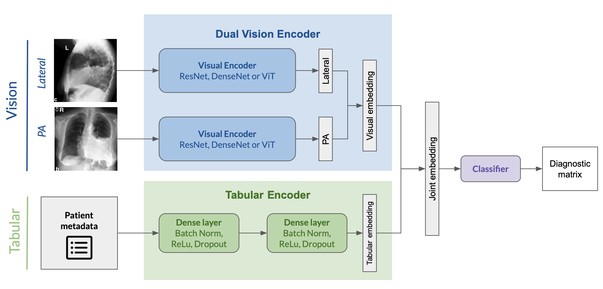

### Classification of Chest X-ray Images and Patient Metadata Using Multi-Modal Model

#### Deep Learning in Biomedicine: Final Project
**Team 4**: Alexander Sternfeld, Silvia Romanato and Antoine Bonnet

In this project, we propose a multi-modal model for radiology diagnosis by combining chest X-rays and tabular patient information. We aim to show that the combination of these two modalities can improve the performance of the model compared to using only one of them. 



#### **Repository breakdown**

- `multimodal/` : code for the multi-modal model
  - `data.py` : multimodal (vision and tabular) data pre-processing and dataset class
  - `models.py` : model architectures for the joint encoder, dual vision encoder and tabular encoder models
  - `train.py` : training and grid search functionalities using Weights and Biases and Huggingface trainers
  - `biomed.ipynb` : quickly shows our data pre-processing and model architectures
- `sweeps/` : grid search hyperparameter configurations
- `project_proposal.pdf` : initial project proposal
- `report.pdf` : final report

#### **How to run our code**

To run our code, you will need to request access and download the [MIMIC-IV](https://physionet.org/content/mimiciv/2.2/) and [MIMIC-CXR-JPG](https://www.physionet.org/content/mimic-cxr-jpg/2.0.0/) datasets in the `data/mimic-iv` and `data/mimic-cxr-jpg` folders respectively.

You will also need to install the required packages in a virtual environment as follows:

```bash
pip install -r requirements.txt
```

You can then run the training script by running the following command:

```python
python multimodal/train.py \
    --- tabular 1 \
    --- vision 'densenet121' \
    --- hidden_dims '128-256-512' \
    --- dropout_prob 0.1 \
    --- batch_norm \
    --- lr 0.001 \
    --- weight_decay 0.0 \
    --- num_epochs 10 \
    --- seed 0
```
